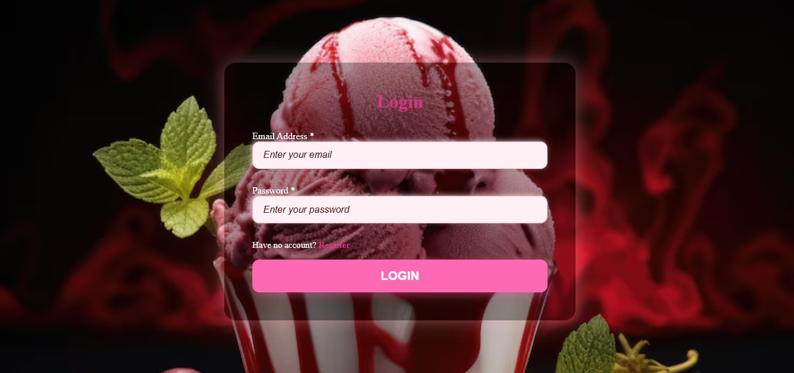

## 🍦 Crème & Co. Website
A full-stack PHP web application built as a personal project to deepen my PHP skills. It’s a booking-style website for a boutique Crème & Co.. A cozy space where users can explore flavours, make reservations, and enjoy curated experiences around premium frozen treats.

## 📸 Preview

## 🚀 Features
User registration & login

Responsive landing page

Flavor catalogue & image uploads

Booking form with backend validation

Admin dashboard

Styled using custom CSS (no heavy frameworks)

## 🧱 Tech Stack
PHP (Core logic and routing)

MySQL (Database storage)

HTML & CSS (Frontend layout)

## ⚙️ Setup Instructions
Clone this repository

Set up a local server (e.g., XAMPP, Laragon)

Import the SQL file into your MySQL server

Configure your /config/conn.php file with database credentials

Run index.php in your local browser

## 🎯 Purpose
This project was born out of the need to adapt and grow after joining a company that primarily uses PHP. It's both a training ground and a real-world experiment.

## 📌 Status
Still in development — refining the UI and building out more dynamic features. Open to feedback and collaboration.
